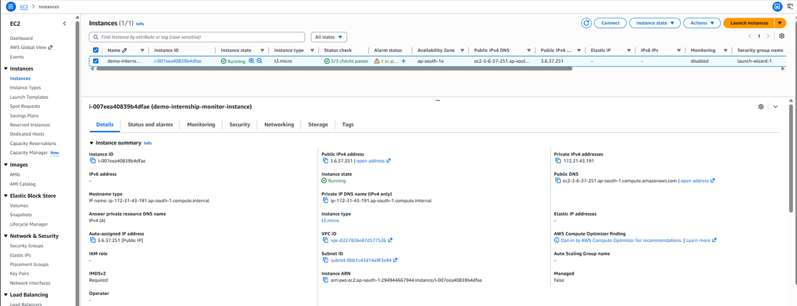
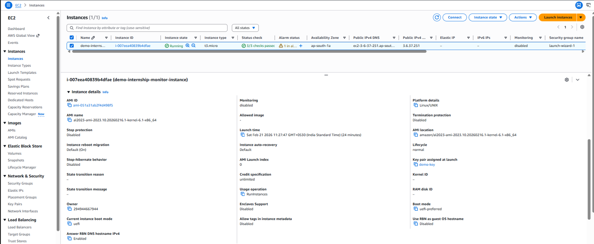
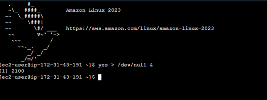
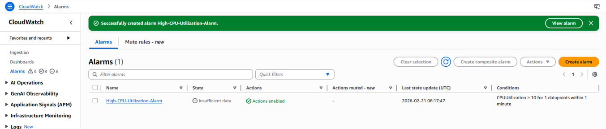
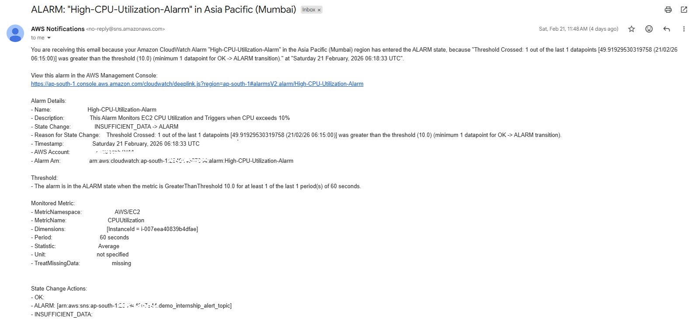
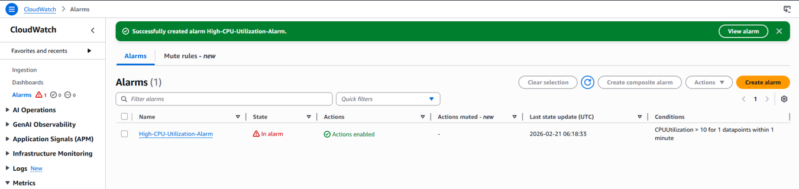
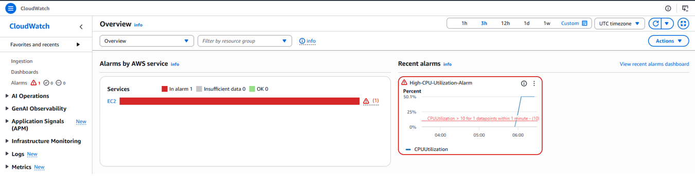
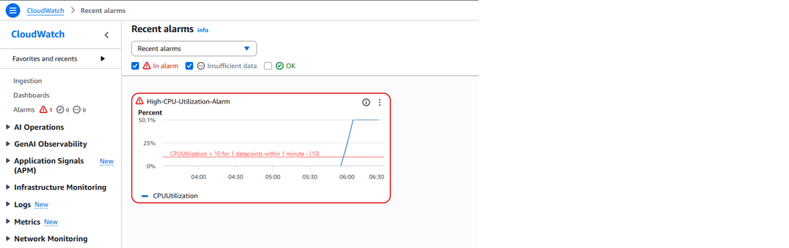
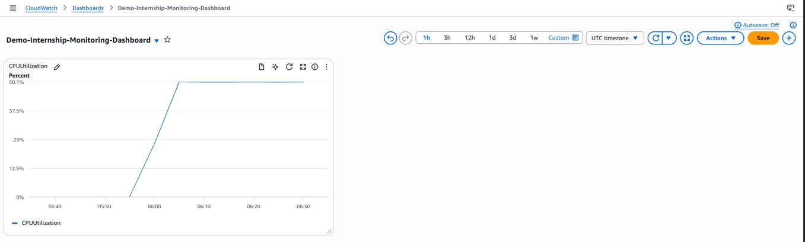
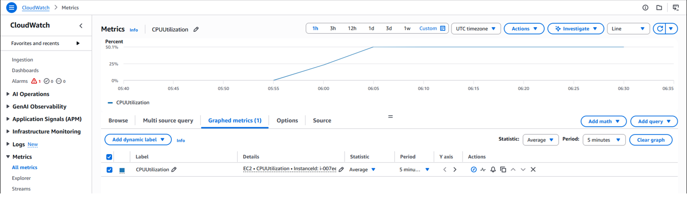

# Task 2: Cloud Monitoring and Alerts using AWS CloudWatch

📌 Objective
To monitor a cloud-based EC2 instance using AWS CloudWatch and configure alerts that notify when system resource usage exceeds a defined threshold.

________________________________________

☁️ Cloud Platform Used
- **Cloud Provider:** Amazon Web Services (AWS)
- **Monitoring Service:** CloudWatch
- **Resource:** EC2 Instance (Free Tier)

________________________________________

🛠 Tools & Services
- AWS EC2
- AWS CloudWatch
- CloudWatch Alarms
- Amazon SNS (Email Notification)

________________________________________

🔧 Implementation Steps

1️⃣ EC2 Instance Details
An EC2 instance was launched using the AWS Free Tier.  
This instance serves as the monitored cloud resource.

________________________________________

2️⃣ Simulating High CPU Utilization
To test monitoring and alerting, high CPU usage was intentionally generated using the following command in the EC2 Bash terminal:

``bash
yes > /dev/null &
This command continuously consumes CPU resources, allowing the alarm to be triggered.

________________________________________

3️⃣ Creating CloudWatch Alarm
A CloudWatch alarm was configured with the following parameters:
•	Metric: CPU Utilization
•	Threshold: CPU utilization greater than defined limit
•	Evaluation Period: Continuous monitoring
•	Action: Send notification via email

________________________________________

4️⃣ Email Notification Triggered
When CPU utilization crossed the threshold, an email notification was sent to the registered email address using Amazon SNS.

________________________________________

5️⃣ Alarm State Change
The alarm state changed from OK to In Alarm as CPU usage remained high, indicating successful alert triggering.

________________________________________

6️⃣ High CPU Utilization Warning
CloudWatch displayed a warning indicating high CPU utilization for the EC2 instance, confirming abnormal resource usage.

________________________________________

7️⃣ Metric Graph Visualization
The CPU utilization metric was visualized using CloudWatch graphs, showing a clear spike in usage during the test period.

________________________________________

📊 Results
The EC2 instance was successfully monitored using AWS CloudWatch.
High CPU utilization was detected, alarms were triggered correctly, and notifications were delivered via email.
Metric graphs clearly showed the increase in CPU usage, validating the monitoring setup.
________________________________________

✅ Conclusion
This task demonstrated the effective use of AWS CloudWatch for real-time monitoring and alerting.
By configuring alarms and notifications, potential performance issues can be detected early, ensuring better reliability and system management

